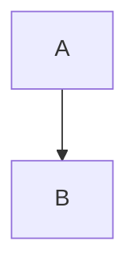
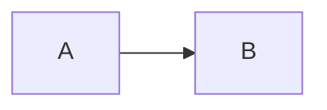
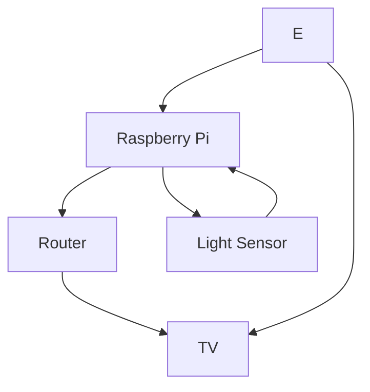

# EGL315-

## Name
Bryan Ho

*Bryan Ho*

**Bryan**

***Bryan***

## School
There are two options to insert code

### Code Block
```
I am at Nayang Polytechnic
Block S
Room 540
```

## Code Line
`sudo raspi-config`

## Adding Picture(Hold shift)

This is a fantastic pic


## Block Diagram
Top to Down

Left to Right



